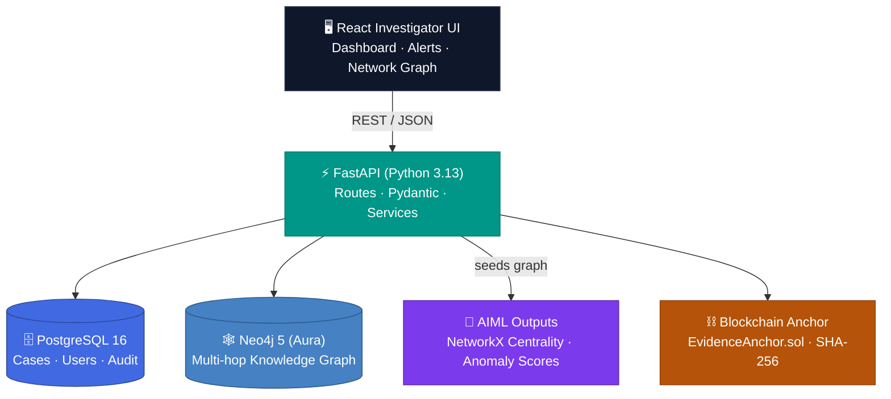

<div align="center">

# NetraLink

### Investigation Graph Intelligence Platform

Anomaly detection over telecom & financial networks, a live **Neo4j** knowledge graph,
investigator dashboards, and cryptographically anchored evidence — all in one platform.

[](https://netralink.onrender.com)
[](https://www.python.org/)
[](https://fastapi.tiangolo.com/)
[](https://react.dev/)
[](https://vitejs.dev/)

[](https://neo4j.com/)
[](https://www.postgresql.org/)
[](https://networkx.org/)
[](LICENSE)

</div>

---

## Overview

**NetraLink** is a full-stack investigation platform that turns raw call-detail records (CDR),
financial transactions, and police FIR reports into a **searchable knowledge graph** of suspects,
phones, accounts, vehicles, and locations — scored by machine-learning anomaly detection and
coupled with **tamper-proof evidence hashing**.

Investigators can browse anomaly alerts, explore multi-hop network connections on an interactive
force-directed graph, manage open cases, and anchor case evidence with SHA-256 digests that can be
committed to an EVM blockchain.


> **Note:** The live link above is a placeholder — swap in your Render URL once deployed.

---

## ✨ Key Features

- 🕸️ **Live Neo4j Knowledge Graph** — persons, phones, accounts, vehicles, locations & FIR/incident nodes joined by `OWNS`, `CALLED`, `TRANSFERRED_TO`, `MENTIONED_IN`, `REPORTED_AT`, `SEEN_AT` and `ASSOCIATED_WITH` edges, each carrying evidentiary timestamps and confidence scores.
- 📊 **Anomaly Intelligence** — telecom call-volume/diversity scoring plus financial flow analysis (networkX centrality, anomaly scores, alert priorities).
- 👨‍💻 **Investigator Dashboard** — reactive React 18 UI with SVG force-directed graph rendering, search, zoom/pan, and per-entity panels.
- 🔎 **FIR NLP Entity Linking** — auto-matches suspects/locations mentioned in FIR reports back into the graph.
- 🔐 **Cryptographic Evidence Anchoring** — SHA-256 content digests with optional EVM blockchain timestamping (`EvidenceAnchor.sol`).
- 📁 **Case Management** — case lifecycle, notes, and per-case evidence uploads.
- 📜 **Self-documenting API** — OpenAPI/Swagger at `/docs`.

---

## 🏗️ Architecture



**Pipeline:** raw telecom/financial CSVs → AIML anomaly & network scoring → seeded into Neo4j as a
property graph → served through FastAPI → rendered in React.

---

## 🧱 Tech Stack

| Layer      | Technology |
|------------|-----------|
| Frontend   | React 18, Vite 5, React Router 6, custom SVG graph engine |
| Backend    | Python 3.13, FastAPI, Pydantic v2, SQLAlchemy 2 + Alembic |
| Graph DB   | Neo4j 5 (AuraDB) |
| Relational | PostgreSQL 16 |
| Analytics  | NetworkX, pandas, numpy |
| Blockchain | Solidity `EvidenceAnchor.sol`, PyContract anchors |
| Deploy     | Render (Web Service + PostgreSQL) |

---

## 🚀 Getting Started

### Prerequisites
- Python 3.13+
- Node.js 18+
- PostgreSQL running locally
- Neo4j instance (local **or** free [AuraDB](https://console.neo4j.io) — recommended)

### 1. Configure environment

```bash
cd backend
cp .env.example .env   # then fill in DB_* and NEO4J_* values
```

| Variable | Description |
|----------|-------------|
| `DB_HOST`, `DB_PORT`, `DB_NAME`, `DB_USER`, `DB_PASSWORD` | PostgreSQL connection |
| `NEO4J_URI` | e.g. `neo4j+s://<id>.databases.neo4j.io` (Aura) or `neo4j://localhost:7687` |
| `NEO4J_USER`, `NEO4J_PASSWORD` | Neo4j credentials |
| `NEO4J_DATABASE` | Graph database name (`neo4j` on Aura free tier) |
| `SECRET_KEY` | JWT/auth signing key |

### 2. Backend server

```bash
cd backend
pip install -r requirements.txt
python -m uvicorn app.main:app --reload --port 8000
```

On first start the backend auto-creates Postgres tables and **seeds the Neo4j knowledge graph**
from `data/raw/exports`. Then browse:

- API & Swagger: http://127.0.0.1:8000/docs
- Health check: http://127.0.0.1:8000/health

### 3. Frontend UI

```bash
cd frontend
npm install
npm run dev
```

Open **http://localhost:5173** — the Vite dev server proxies `/api` to the backend.

---

## 🗂️ Project Structure

```
NETRALINK/
├── docs/                 # Architecture & plan docs
├── data/raw/             # Source CSVs (persons, phones, accounts, cdr, fir, transactions…)
├── aiml/                 # Jupyter notebooks + outputs (anomaly scores, graph .pkl)
├── backend/              # FastAPI application
│   ├── app/api/routes/   # alerts, cases, fir, graph, persons, transactions
│   ├── app/neo4j/        # client, schema, importer, queries
│   ├── app/aiml/         # output loader
│   ├── app/db/           # SQLAlchemy models + engine
│   ├── app/services/     # graph service, evidence service
│   └── app/security/     # auth + RBAC
├── frontend/             # React + Vite SPA
│   └── src/pages/        # Dashboard, Alerts, Graph, PersonDetail…
└── blockchain/           # EvidenceAnchor.sol + anchoring scripts
```

---

## ☁️ Deploying to Render

1. Push this repository to GitHub.
2. Create a **Render PostgreSQL** instance.
3. Create a **Render Web Service** from the repo:
   - **Build command:**
     ```
     cd backend && pip install -r requirements.txt && cd ../frontend && npm ci && npm run build
     ```
   - **Start command:**
     ```
     cd backend && uvicorn app.main:app --host 0.0.0.0 --port $PORT
     ```
   - **Health check path:** `/health`
4. Set environment variables in the Render dashboard (`DB_*`, `NEO4J_*`, `SECRET_KEY`, `PYTHON_VERSION=3.13`).

The frontend production build is served by the backend, so a single web service serves both the UI
and the API on the same origin.

---

## 📡 API Overview

| Endpoint | Description |
|----------|-------------|
| `GET /api/v1/graph/neo4j/full` | Entire knowledge graph (nodes + edges) |
| `GET /api/v1/graph/neo4j/summary` | Label & relationship counts |
| `GET /api/v1/graph/neo4j/entities?q=` | Entity search |
| `GET /api/v1/graph/neo4j/entities/{id}/neighbors` | Direct relationships |
| `GET /api/v1/graph/neo4j/entities/{id}/two-hop` | Two-hop expansion |
| `GET /api/v1/alerts` | Anomaly alerts |
| `GET /api/v1/persons` | Anomaly-scored persons |
| `GET /api/v1/transactions` | Financial ledger |
| `GET /api/v1/fir/entities` | FIR NLP entity matches |
| `GET /api/v1/cases` | Investigator cases |
| `POST /api/v1/cases/{id}/evidence` | Upload & hash case evidence |

Full interactive docs at **`/docs`** (Swagger UI).

---

## 📜 License

MIT — free to use, modify, and distribute.

<div align="center">

Built with ❤️ — **NetraLink** · Investigation Graph Intelligence

</div>